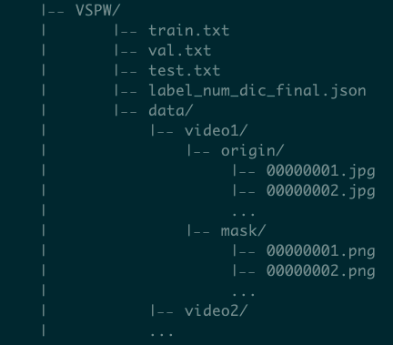

# VSPW-dataset-download


This is the entire VSPW dataset with ground truth masks and all extracted frames.


```
CVPR2021 VSPW dataset download links

Google Drive: https://drive.google.com/file/d/14yHWsGneoa1pVdULFk7cah3t-THl7yEz/view?usp=sharing (1 file, 43G)

Google Drive: https://drive.google.com/drive/folders/1BpN3yLSCDf0kz6kP74mIrcTysI75sTwi?usp=sharing (6 files, each 8G)

Baidu YunPan: https://pan.baidu.com/s/1ZaUt5bm_qyLHbllugyG3wA 密码:rz3m

cat VSPW_data.tar_a* > VSPW_data.tar
tar -xvf VSPW_data.tar
```


```
VSPW 480P download links:

Google Drive: https://drive.google.com/file/d/1rRujAmy3mzYqI0NjrdyVANDfrnFnBEp1/view?usp=sharing

Baidu YunPan: 链接:https://pan.baidu.com/s/1p3HNj6_-DtnTt-aHAsSVlA 密码:akga
```

### Update: Some images from "988_f_Xvy_DCPt8" are damaged or incomplete with 0 byte. The images are avaiable here:

```
Google Drive: https://drive.google.com/file/d/1kuQksbhw_sgB5n6fKzts2G9KZn41-q_N/view?usp=sharing

Baidu YunPan: 链接: https://pan.baidu.com/s/1J6zxUm41Dd36YccYCLmycA 密码: ww7a
```


## Instruction

          
               


**Notice**:  Our ground truth mask contains values from 0 to 124 and 255.  0 indicates "others" and 255 indicates "void label". During evaluation, both 0 and 255 are void classes.  Thus we recommend using the following code:

```
label[label==0]=255
label=label-1
label[label==254]=255

```

## Download and Extract Original Video Frames

Edit video_download.sh, change VIDEO_SAVE_PATH to '/your/path/to/save/video' and change TARGET_PATH to '/your/path/to/VSPW/folder'.

sh video_download.sh


## Contact

